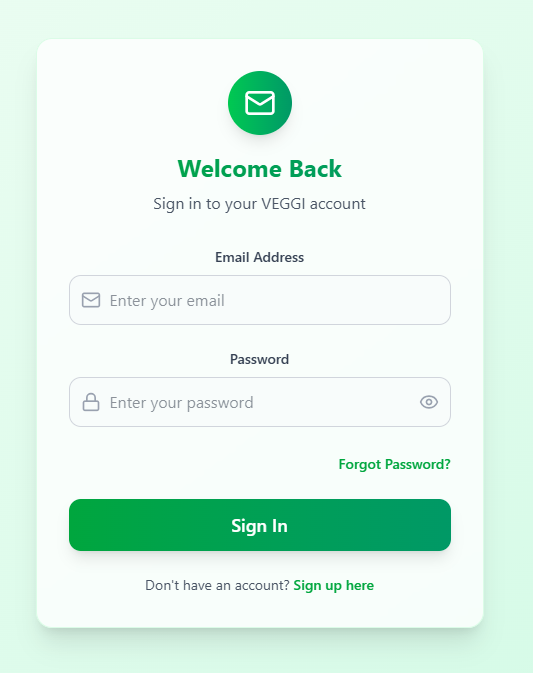
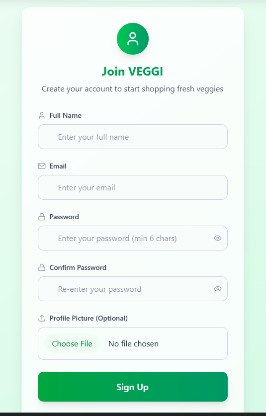
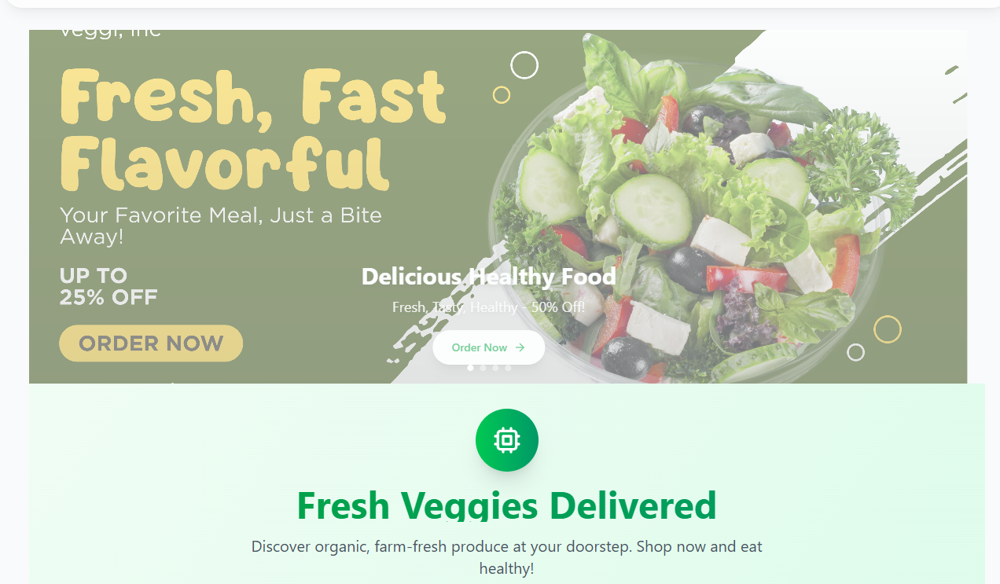
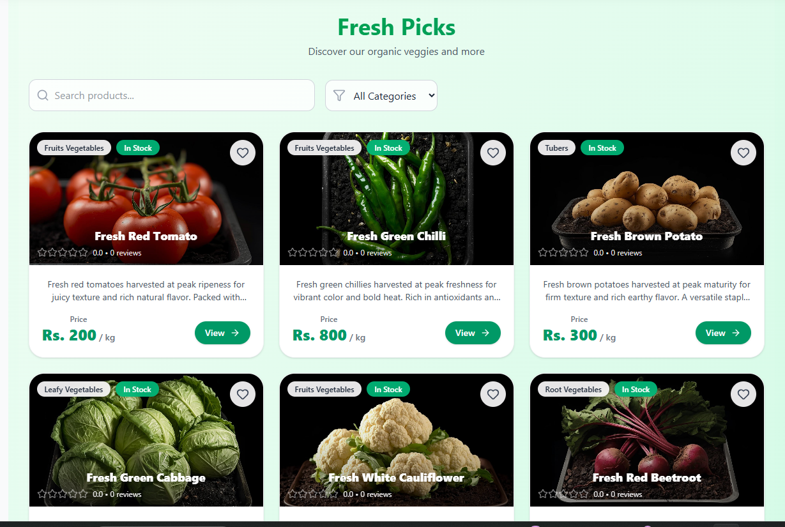
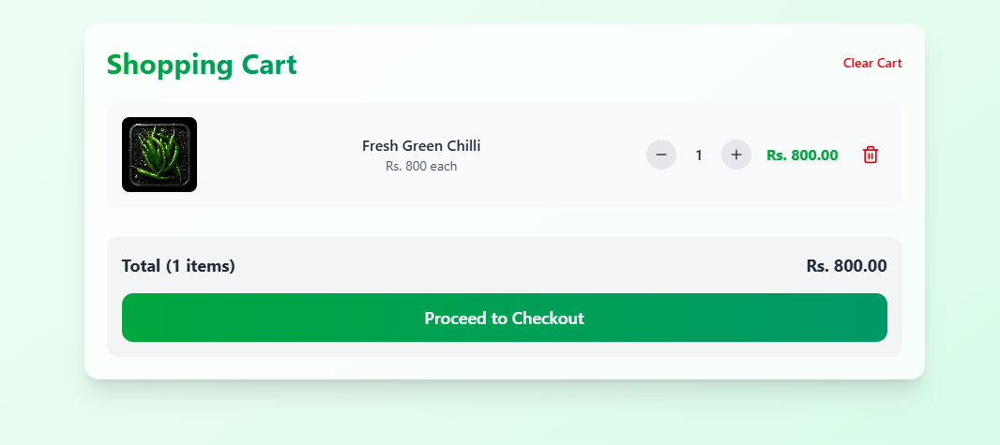
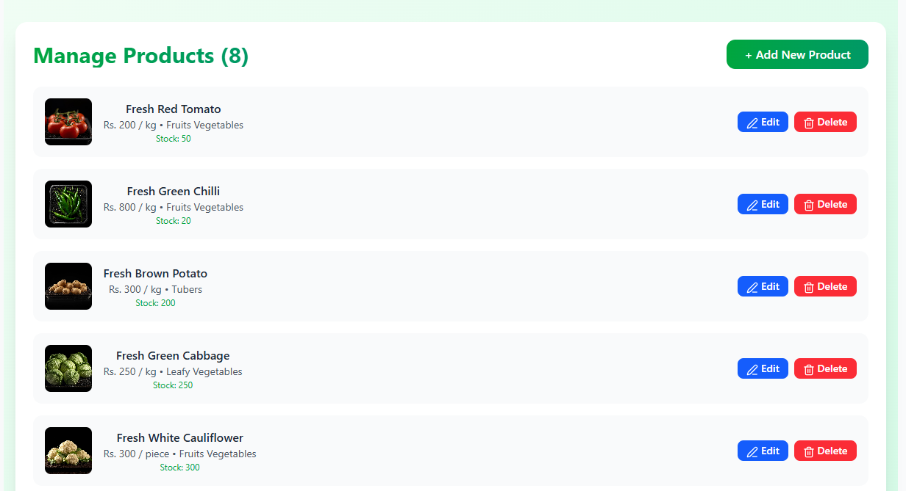
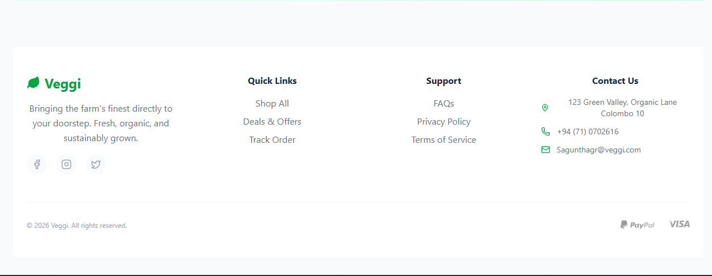

# VeGGi - MERN Stack (TypeScript)

VeGGi is a MERN Stack web application built with TypeScript.  
Frontend is deployed on Vercel and backend is deployed on Railway with MongoDB Atlas.

## Live Links

- **Frontend (Vercel):** https://veggi-inc.vercel.app  
- **Backend (Railway API):** https://veggiinc-production.up.railway.app

## Screenshots
###Login Page

###Sign Up Page

###Banner Page

###Home Page

###Product Details

###Shopping Cart Page

###Checkout

###Admin

###Footer Page

## Tech Stack

**Frontend**
- React + TypeScript (Vite)
- Tailwind CSS
- Axios
- Framer Motion

**Backend**
- Node.js + Express + TypeScript
- MongoDB Atlas + Mongoose
- JWT Authentication (Cookies)
- Multer + Cloudinary (Image Upload)
- PayHere Payment Integration

## Features

- User Authentication (Register/Login/Logout)
- Admin Product Management (Create/Update/Delete)
- Product Listing + Product Details
- Cart & Checkout
- Cloudinary Image Upload
- PayHere Payment Hash + Notify Webhook
